# Autonomous Due Diligence Agent: Walkthrough

This document demonstrates the end-to-end flow of the Autonomous Due Diligence Agent, showcasing how it handles complex multi-agent analysis for AAPL (Apple Inc.).

---

## 1. Starting a New Analysis
The process begins at the **Launch Dashboard**. The user enters a company ticker (`AAPL`) and selects the analysis type ("Comprehensive").
- **Priority:** Normal
- **Context:** Focus on recent antitrust risks (optional)

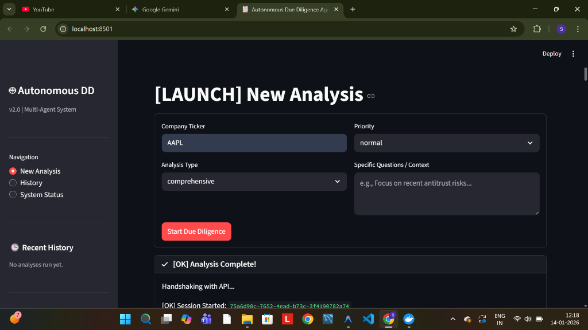

---

## 2. Executive Summary (Synthesis)
After the agents complete their work (Financial, Legal, and Market teams), the **Orchestrator** synthesizes the findings into a Lead Investment Banker's Executive Summary.
- **Financials:** Highlights ROE (151.91%) and Debt/Equity ratio.
- **Legal:** Confirms clean litigation history but notes high leverage risk.
- **Market:** Validates growth opportunities vs. competitive threats.

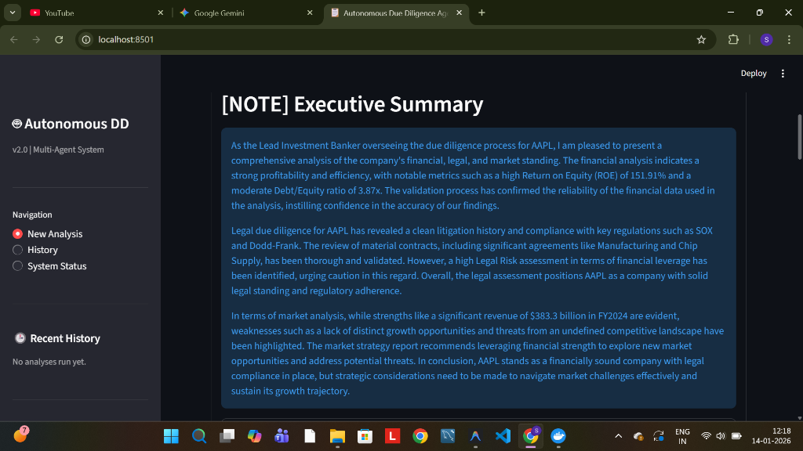

---

## 3. Risk Assessment
The system performs a dedicated **Risk Assessment** using the gathered data.
- **Risk Level:** MEDIUM
- **Score:** 5/10
- **Key Risks:** Identifies high debt/equity ratio (3.87x) and data quality gaps (limited historical metrics in this specific run).

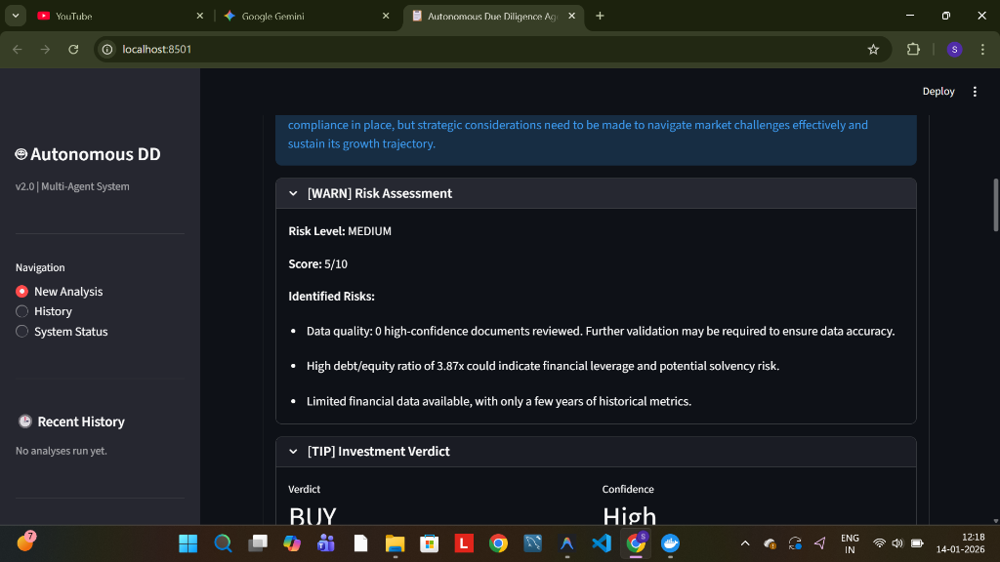

---

## 4. Investment Verdict
Based on the synthesis, the agent provides a final **Investment Verdict**.
- **Verdict:** **BUY**
- **Confidence:** High
- **Reasoning:** Strong profitability and efficiency outweigh the leverage risks.

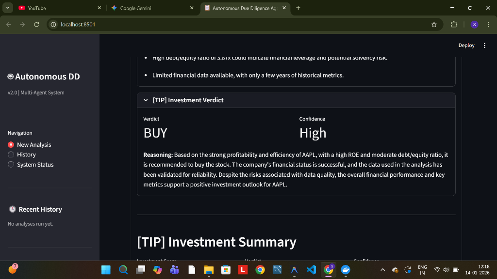

---

## 5. Comprehensive Dashboard
The analysis concludes with a detailed **interactive dashboard** allowing users to dive deep into specific sectors.
- **Investment Score:** 80/100 (Strong Buy)
- **Key Ratios:** Real-time calculation of Profit Margin, ROE, etc.
- **Deep Dive Tabs:** Users can switch between `[MONEY] Financial`, `[SCALE] Legal`, and `[WORLD] Market` tabs to see the raw agent logs and detailed citations.

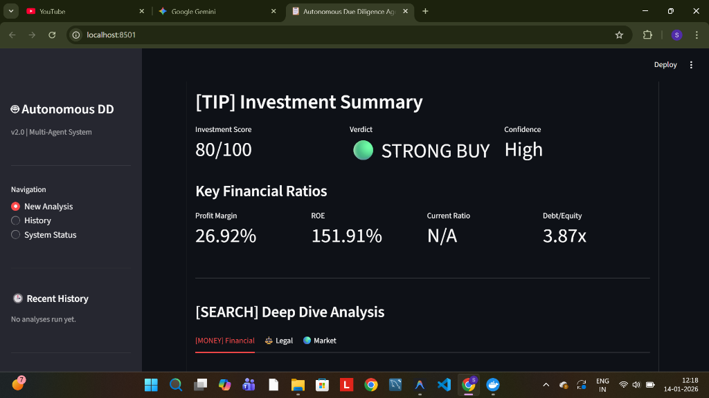

---

## 6. Additional Analysis Details
Further details from the analysis tabs and logs:

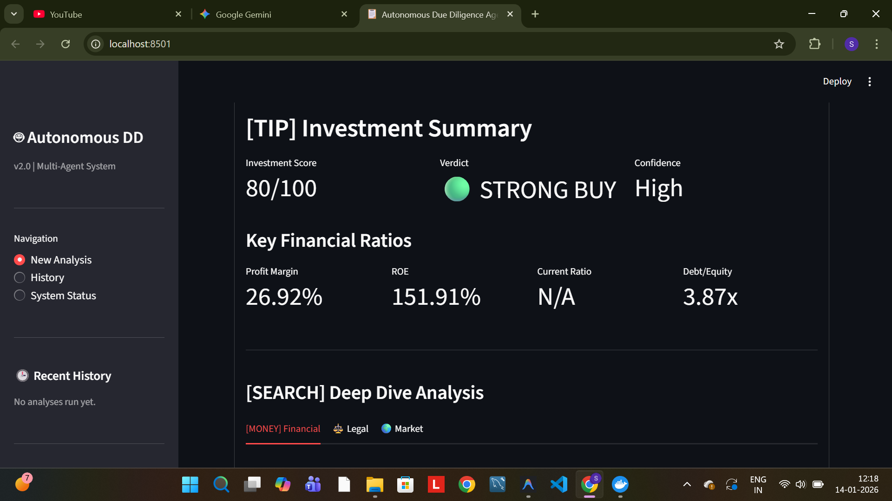
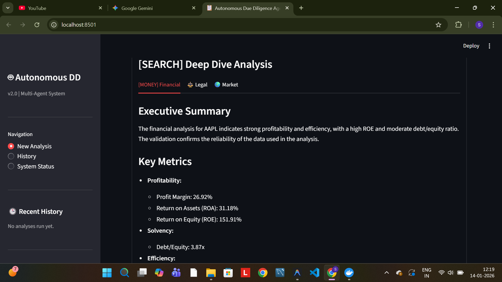
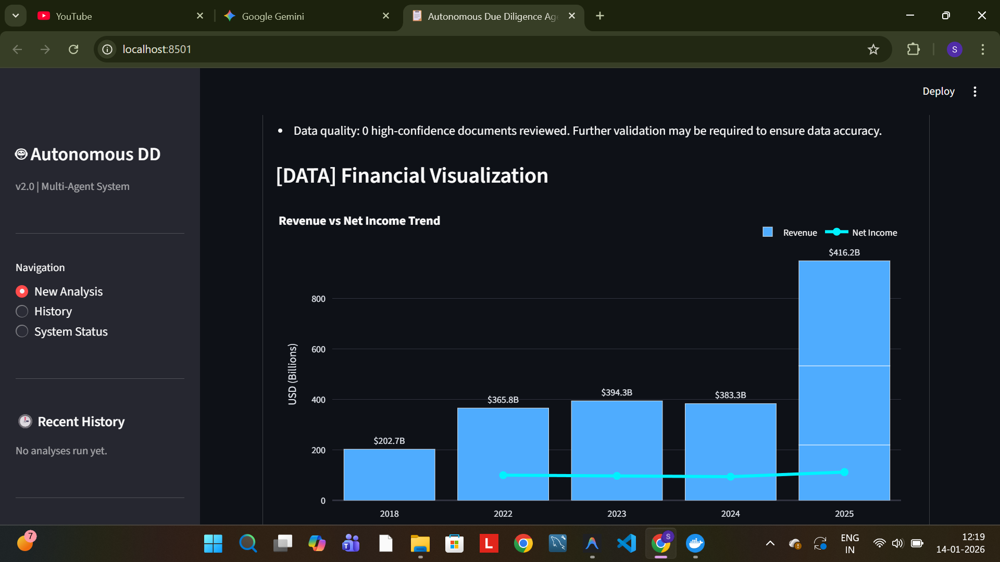
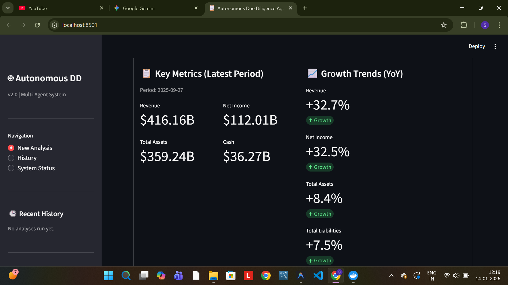
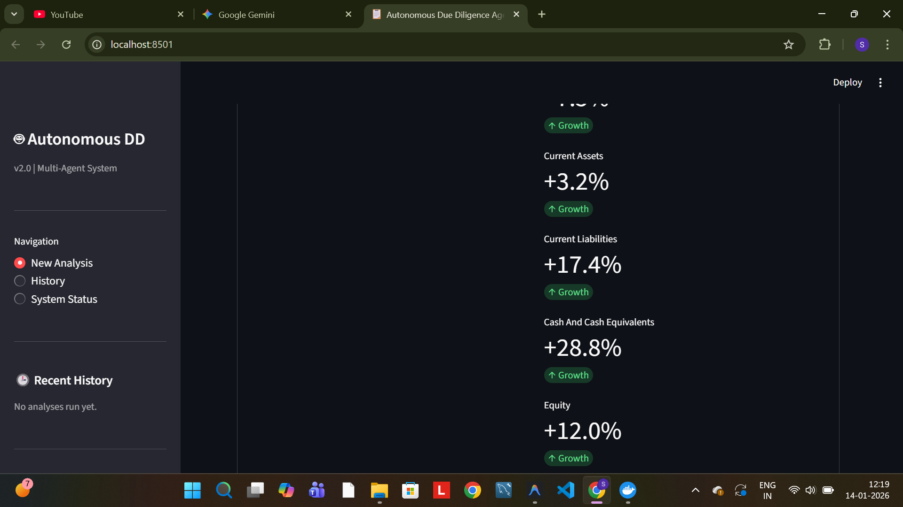
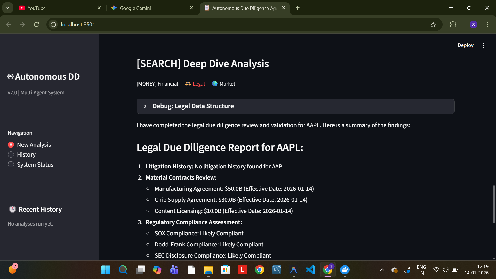
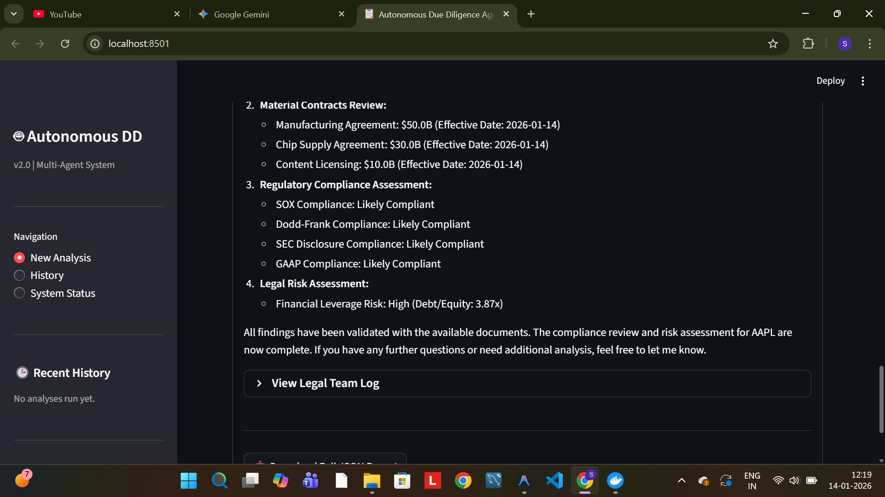
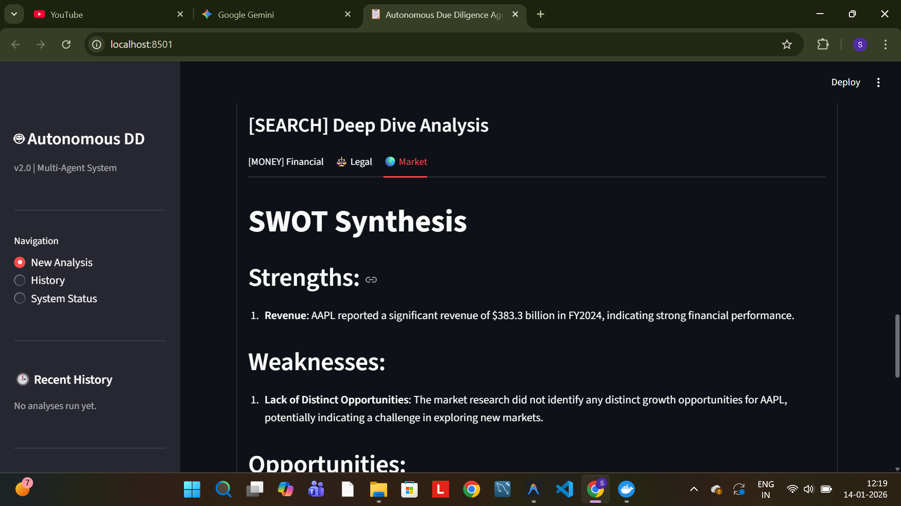
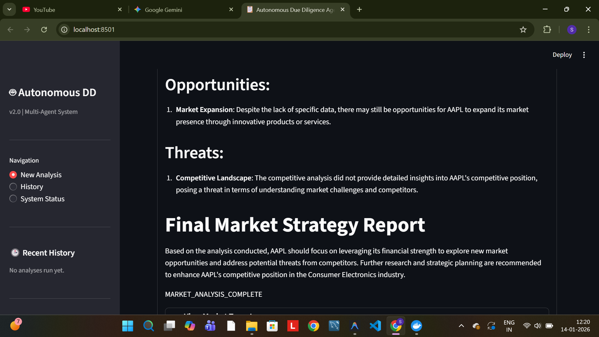
